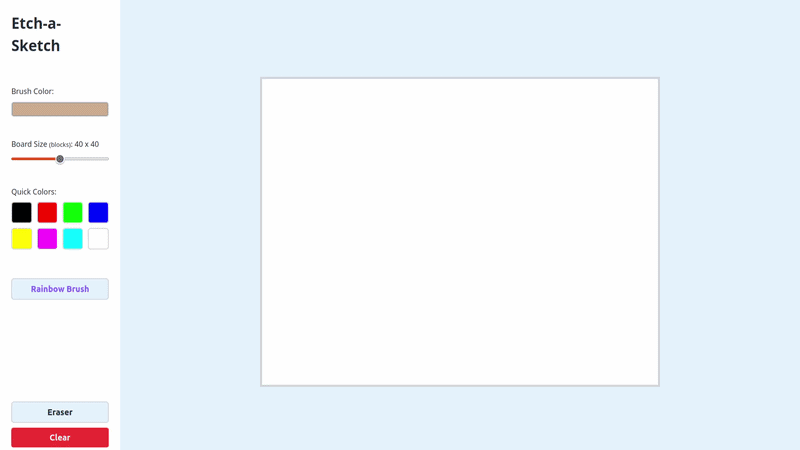

# Rabiskme

An Etch-a-Sketch web application built with vanilla JavaScript.

## Demo

**Live Preview:** [https://rabiskme.netlify.app/](https://rabiskme.netlify.app/)

## About

**Rabiskme** is a digital recreation of the classic Etch-a-Sketch toy, implemented as a web application using vanilla JavaScript. It provides an interactive grid-based drawing canvas where users can create artwork with various drawing modes, color options, and adjustable board sizes.

## Features

- **Drawing Board**: Interactive grid-based drawing surface
- **Color Selection**: Custom color picker and quick color palette
- **Rainbow Mode**: Automatic color cycling for vibrant drawings
- **Eraser Tool**: Remove drawings with eraser functionality
- **Adjustable Board Size**: Dynamic grid resizing from 16x16 to 64x64 blocks
- **Visual Mode Indicators**: Clear feedback for active drawing modes

## Development

This project is currently in MVP development phase.
